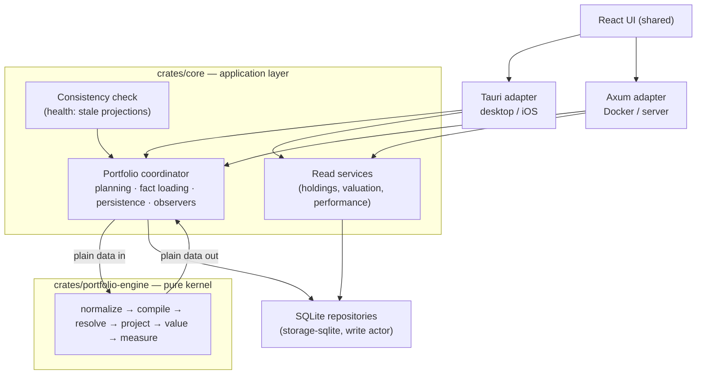

# Portfolio engine architecture

How Wealthfolio turns activities, quotes and exchange rates into holdings,
valuations and performance. The calculation path is split in two: a pure kernel
crate that owns the mathematics, and a shell that owns everything the answer
must not depend on — time, storage, network and scheduling.

What it must produce where the answer is a decision (money in and out,
transfers, dates and currencies, dated reads, and which writes invalidate which
results) is stated in [portfolio-engine-rules.md](portfolio-engine-rules.md):
code and tests follow it.

## 1. Overview

`crates/portfolio-engine` is a **pure, deterministic calculation kernel**: facts
in, values out. It has no I/O, no clock, no locks and no async. The same facts
produce byte-identical results on any host, any day, any machine.

Six stages, each a total function of its arguments:

| Stage              | Input                                    | Output                                     |
| ------------------ | ---------------------------------------- | ------------------------------------------ |
| `normalize`        | raw rows (strings, UTC instants)         | typed, ordered facts with transfer pairs   |
| `compile`          | canonical facts                          | economic events (the single authority)     |
| `resolve_surfaces` | quotes, FX observations, split events    | resolved price and rate surfaces           |
| `project`          | events + surfaces + optional prior state | daily positions, cash, lots, disposals     |
| `value`            | projection + surfaces                    | dense daily valuations with typed statuses |
| `measure`          | valuations + events + lots + disposals   | returns, attribution, risk                 |

`crates/core` holds the **coordinator**: it decides what to recalculate, loads
the facts, calls the kernel, persists the results and tells the hosts what
happened. The two hosts (Tauri for desktop and iOS, Axum for server and Docker)
contribute UI events, authentication and scheduling — nothing else.

## 2. Design principles

**P1 — Single economics authority.** Every consumer (accounting, valuation,
performance, health) reads canonical `EconomicEvent`s produced by one compile
stage. Nothing downstream re-interprets a raw activity.

**P2 — Purity and determinism.** No clock, no I/O, no locks, no async inside the
kernel. "Today" and the user's timezone are policy fields, not ambient state.
Identical facts give identical bytes.

**P3 — Compile-time boundary.** The kernel's dependency list is the enforcement,
not a convention: adding a database or runtime crate is a build failure.

**P4 — Honest degradation.** Missing or invalid inputs produce typed statuses
and diagnostics. Never a silent zero, a silent `rate = 1`, a silent currency
default, or an account quietly dropped from a total.

**P5 — One coordinator, two hosts.** A single recalculation sequence serves both
hosts; host code is UI events, auth and scheduling.

**P6 — Provable incremental correctness.** A resumed or chunked run is equal to
a full fold by property law, not by hope, which is what makes incremental
rebuilds safe to run by default.

### Scope boundaries

- No event sourcing, CQRS, message brokers or durable queues. What is stale is
  recorded where facts change: SQLite triggers write markers to one table,
  `projection_state` (§3.3).
- No microservices, actor frameworks, dependency-injection containers or
  incremental-computation frameworks. This stays a modular monolith.
- No new formats for the existing read models: sparse keyframes, dense daily
  valuation rows, lot and disposal rows keep their shapes. One additive table
  supports the lifecycle: `projection_state`.
- Market-data fetching, broker sync, device sync and the frontend are outside
  this architecture.
- Cost basis is per account (rules §7); the methods computed are FIFO, WAC, LIFO
  and HIFO. A method is a choice of which lots a disposal relieves and how much
  of each: one function of the projection (`units_taken`) names the effective
  units each lot gives, and `relieve` and `split_for_cover` slice the lots by
  it. FIFO, LIFO and HIFO are one pass over lots in the method's order
  (`relief_order`). Under WAC a position's lots first pool into one
  (`pool_lots`, rules R7.2), so a sale is one disposal however many purchases
  built the position. A new method is a variant of `CostBasisMethod` with its
  branch there, rules entry, fixtures, and every property law passing under it
  (a code core does not know yet, beyond FIFO, LIFO, HIFO and WAC, is also added
  to core's settings). Settings the engine does not compute, or that this
  version cannot read, fail loudly per account rather than being silently
  computed as FIFO. Pooling across accounts, rules that look ahead and choosing
  specific lots per disposal are outside this design (rules R7.3).

## 3. System architecture

### 3.1 Topology

Two hosts, three deployment forms, one calculation kernel.



The kernel knows nothing about Tauri, iOS, Axum, Docker, async runtimes or
SQLite. In-memory domain events remain the intra-process signal that something
changed.

### 3.2 Responsibility split

| Concern                                                                                 | Kernel                  | Shell    |
| --------------------------------------------------------------------------------------- | ----------------------- | -------- |
| Economic interpretation of activities (transfer pairing, flow classification)           | owns                    | —        |
| Position, cash, lot and net-contribution projection                                     | owns                    | —        |
| Quote and FX **resolution** (carry, minor units, inverse, triangulation, split factors) | owns as explicit policy | —        |
| Quote and FX **fetching** (providers, retry, sync)                                      | —                       | owns     |
| Daily valuation, flow finalisation, performance math                                    | owns                    | —        |
| What to recalculate, when, for whom                                                     | —                       | owns     |
| Persistence, batching, transactions                                                     | —                       | owns     |
| Caching, single-flight, parallelism                                                     | enabled by purity       | owns     |
| Event emission, auth, scheduling, UI                                                    | —                       | owns     |
| Clock ("today") and user timezone                                                       | parameters              | supplies |

The rule: anything whose answer could differ between two machines (network,
disk, clock, cache) is shell; anything two machines must agree on given the same
facts is kernel.

**Persistence shapes.** Snapshots are sparse keyframes (first day and activity
days); valuations are dense daily rows. The kernel emits the dense series and
the shell keeps the existing cadence. Lots and disposals are read models derived
from the same projection state. Rows are written one window at a time (§3.3);
the lot book, the activity issues and the cleared markers are committed together
at the end of a run.

### 3.3 Recalculation lifecycle

Hosts suspend, close and restart mid-work, and mobile apps are killed between a
write and its recalculation. So what is stale is recorded where facts change, in
the same transaction.

**Markers.** Triggers write rows of `projection_state`: an account id (its
activities, accounting settings or observed snapshots changed: refold it),
`a:<asset>` (the asset's kind, quote currency, instrument type or contract
multiplier changed, or one of its splits), `q:<asset>` (its prices changed),
`fx:<asset>` (an FX asset's rates changed) and `@all` (the base currency or the
timezone changed). Each carries the first changed day and a version every write
bumps. An activity marks its account from the day before its UTC date (its local
day is within a day of it) and its transfer partners from theirs. Markers record
what changed, never what it affects. The projection's own calculated rows mark
nothing. The migration starts with `@all` from the beginning, so the first run
rebuilds everything.

**Plans.** What a change affects is the kernel's answer, derived from what its
stages read (`impact`, §4.3): a job turns each marker into the fact change it
records, adds what only its store knows (an account whose valuations end before
today, whose valued range therefore grew; an account never valued), and gets
back one path and first stale day per account:

| Verdict                                                  | Plan        | Work                                                                   |
| -------------------------------------------------------- | ----------- | ---------------------------------------------------------------------- |
| Nothing marked, valuations reach today                   | —           | nothing is loaded                                                      |
| Prices or FX changed, or the day moved                   | **Revalue** | value stored keyframes (or observed snapshots) from the day; rows only |
| Facts changed (the account, a partner, an asset, policy) | **Refold**  | fold from the first activity; rewrite rows from the day                |

The kernel's rules: prices revalue their asset's holders from the day, or from
the beginning when the close is one of the two around a split (they decide
whether the provider already adjusted the series, which rescales every earlier
price). Conversions take the nearest FX observation in either direction, so a
changed rate reaches back to the day after its pair's previous observation:
every account revalues from there, and only accounts with activity since then
also refold (the fold converts on activity days alone). Asset facts and splits
refold the asset's holders from the beginning. When the day moves, facts dated
in the new days (a scheduled deposit) were outside the previous range, so their
account refolds; a split among them revalues its asset's holders from the
beginning. A refold reaches the account's transfer partners.

Holdings-mode accounts only revalue: their facts are observed snapshots. A
refold is not resumed from a stored state: folding the refolded accounts (and
their transfer partners) from the first activity in memory, without valuing or
writing the windows before the stale day, is cheap next to the writes it avoids,
and needs no checkpoint table. Accounts that only revalue are not folded.

**Windows.** A run walks its range in one pass of windows (calendar years), cut
at each day an account starts rewriting. The fold carries its state from window
to window in memory; before the first rewritten day it only folds. From then on
each window loads once the quotes of the assets its accounts reference (plus
each asset's last usable quote before the window), values the refolded accounts
from the fold and the revalued ones from their stored keyframes against those
quotes, and writes their rows together before the next window is read, so memory
holds one window plus the running state however long the history. Activities, FX
rates and observed snapshots load whole; the provider-adjusted splits are
resolved once, from every split of the run's assets (whichever account recorded
it, archived ones included) and each split's last usable close before it and
first after it, however far away. Window invariance (P-WIN) makes a windowed run
equal to one run over the range, and the app parity law (§5) holds the
coordinator and the read path to the same answer.

**Snapshot reads.** Repositories return snapshot positions as stored. Every
reader that shows or values a holdings account's positions on a later day gets
them through `SnapshotService` (`get_latest_snapshots_as_of`,
`get_latest_holdings_snapshot`: holdings, account values, net worth) or
`HoldingsService::get_asset_lot_view` (the asset page's lots), which carry the
quantities across the splits recorded since the snapshot's date with the
engine's own grouping (`SplitRow`, `group_splits`, rules R1.5), so every screen
agrees with the stored valuations. Readers that need what was entered (the
snapshot history and edit views, broker sync, the engine's facts, import
validation) or only whether an asset is held read the stored rows. The
`read_contracts` tests in the storage crate fail on a new reader that bypasses
these services.

**Completion.** After the last window a run commits, in one transaction, the lot
books of the refolded accounts (open lots and lots closed since the stale day),
their disposals, what the fold decided about their activities (rejected,
oversold, posted without an amount), and clears the markers it read, each only
if its version is unchanged: a fact written during the run keeps its marker for
the next one. A failed run clears nothing.

**Job discipline.** Jobs run one at a time and are never skipped, so a later
request always sees the markers left by the facts it was raised for. In-process
failures (storage, engine) retry with backoff; per-account validation failures
are final and reported individually. Event batches debounce with a bounded
maximum wait, so a sustained event stream cannot postpone work indefinitely.

**Entry points.** One idempotent portfolio update (a market sync, then every
stale account brought up to date) serves cold start, the frontend's return to
the foreground, the periodic market-data sync, and device-sync apply. Stale
accounts (pending markers, or valuations ending before today) also surface in
the health check with a repair action.

**Scoping.** Facts load by account and transfer group, transitively: a job reads
its scope's transfer closure, never the whole activity table. Archived accounts
stay visible to pairing so a transfer to or from them classifies correctly.

## 4. The kernel crate

### 4.1 Dependency contract

```
crates/portfolio-engine/
├── Cargo.toml            # runtime deps: the closed list below
├── src/
│   ├── lib.rs            # public API: Engine, the six stages, facts_needed, impact
│   ├── engine.rs         # Engine: normalise, compile, resolve once; derive on request
│   ├── model/            # scalars, Policy, facts, events, states, reports
│   ├── normalize.rs      # stage 1: parsing, ordering, transfer pairing
│   ├── compile.rs        # stage 2: the single economics authority
│   ├── resolve.rs        # stage 3: quote and FX surfaces
│   ├── project.rs        # stage 4: the fold
│   ├── value.rs          # stage 5: pricing and flow finalisation
│   ├── measure.rs        # stage 6: returns, attribution, risk
│   ├── impact.rs         # which stored outputs a change of facts makes stale
│   └── diagnostics.rs
└── tests/                # scenarios, goldens, property laws (§5)
```

**Runtime dependencies (closed list):** `chrono` (date arithmetic; the clock
feature is never used), `chrono-tz` (IANA zone tables, pure data),
`rust_decimal` (+ macros), `serde`, `thiserror`. Dev-dependencies (`insta`,
`serde_yaml`, `serde_json`, `criterion`) never enter the runtime tree.

**Dependency direction:** hosts → `core` → `portfolio-engine`. The kernel
depends on no workspace crate, which is what makes the boundary mechanical: a
kernel that cannot name a repository cannot query one.

**Decimal serialisation.** The workspace enables `rust_decimal` with
`serde-float`, and Cargo unifies features across the graph. Every serialised
decimal in the kernel therefore uses explicit string (de)serialisation, so a
checkpoint or golden never loses precision through a float round-trip.

### 4.2 Domain model

All types are plain data: `Clone + Debug + PartialEq + Serialize + Deserialize`.
No `Arc`, no trait objects, no interior mutability.

**Scalars — parse, don't validate.** Built once in `normalize`; later stages
never see a raw string.

```rust
pub struct Currency(/* validated code; a bucket key and FX-pair component.
                       Minor-unit relations are Policy DATA, not knowledge
                       baked into the type. */);
pub struct AccountId(String);       // opaque
pub struct AssetId(String);         // opaque
pub struct ActivityId(String);
pub struct EventId(String);         // synthetic legs keep traceable ids
```

Money carries its currency, quantities are signed (negative means short), and a
business date is the UTC instant converted through `Policy.timezone` exactly
once. This removes by construction the class of bugs where a date is a string, a
decimal parse falls back to zero, or an amount has no currency.

**Facts — the complete world the kernel may know.** `RawFacts` mirrors database
rows (the only place strings are allowed) and is a **per-invocation scope, not
the database** (§4.8):

```rust
pub struct RawFacts {
    pub policy: Policy,
    pub accounts: Vec<RawAccount>,       // currency, type, tracking mode, archived
    pub assets: Vec<RawAsset>,           // quote currency, kind, instrument, multiplier
    pub activities: Vec<RawActivity>,    // full row incl. subtype, override, status,
                                         //   group id, supplied fx rate, created_at
    pub quotes: Vec<RawQuote>,           // observations, not resolutions
    pub fx_rates: Vec<RawFxRate>,        // observations
    pub observed_snapshots: Vec<RawObservedSnapshot>, // holdings-mode FACTS
}
```

Observed snapshots are **facts, not projections**. A holdings-tracked account's
positions were entered by a person or a broker; the kernel values them but never
derives them, and persistence may only replace what the kernel produced.

**Policy — every tunable explicit.**

```rust
pub struct Policy {
    pub base_currency: Currency,
    pub timezone: Tz,                 // UTC instant → business date, once, in normalize
    pub as_of: NaiveDate,             // "today" is data, never a clock read
    pub minor_units: Vec<MinorUnitRule>, // GBp→GBP ×0.01, ZAc→ZAR, KWF→KWD ×0.001, …
}
// Each account's facts carry its cost basis method (`AccountFacts::cost_basis_method`).
```

The minor-unit table is data: a new minor unit is a data change, not an engine
release. Where normalisation applies is kernel law — activity currencies in
`normalize`, quote closes and FX pairs in `value`.

**`EconomicEvent` — the single authority.** Nothing downstream reads a raw
activity. One type absorbs what used to be five partial interpretations:
composite expansion (dividend reinvestment, staking rewards, dividends in kind),
cash resolution (sign by type, supplied amount authoritative, charges
separated), the transfer flow ladder, scope classification and lot instructions.

```rust
pub struct EconomicEvent {
    pub id: EventId,                 // {activity}:dividend, {activity}:buy for legs
    pub source: ActivityId,          // traceability from number back to fact
    pub account: AccountId,
    pub date: NaiveDate,
    pub timestamp: DateTime<Utc>,
    pub sequence: u32,               // position in the ledger's total order
    pub currency: Currency,
    pub cash: Option<CashEffect>,    // signed final cash, before booking
    pub charges: Charges,            // fees and taxes, classified
    pub action: Action,              // trade | security transfer | split | option expiry
    pub contribution: Contribution,  // net-contribution effect
    pub flow: Flow,                  // external-flow classification and provenance
    pub attribution: Attributed,     // income, fees and taxes performance counts
    pub diagnostics: Vec<Diagnostic>,
}
```

**Flow provenance.** A flow carries its scope (a matched internal transfer is
external to an account and zero to the portfolio) and how its amount was
obtained: cash amount, quote-derived market value, cost-basis fallback,
removed-lot basis, legacy amount, unknown boundary, and, when a day's net
contribution moved without a priced flow, the net-contribution change. `value`
stamps every day's flow with its provenance and `measure` computes from those
flows as stamped: it infers no flow from stored rows and relabels none.
Provenance gates return eligibility and never upgrades under aggregation.

**Transfer pairing** is resolved in `normalize` from the transfer group id only,
deterministically. A group with a leg count other than two, mismatched assets,
or quantities differing by more than a tolerance is unpaired and yields a
diagnostic. Same-account, two-currency cash conversions are valid pairs. Only a
valid pair carries lots from its outgoing to its incoming leg; an unpaired
incoming leg opens a lot at its own price.

**Deferred flows.** Two ladder steps cannot be priced at compile time because
they need later outputs: the removed-lot-basis fallback for an unquoted security
transfer out (needs disposals from `project`) and holdings-mode transition flows
(need keyframe valuations from `value`). `compile` marks them deferred and
`value` finalises them, so `measure` only ever sees final amounts.

**Outputs.**

```rust
pub struct CompiledLedger  { events: Vec<EconomicEvent>, diagnostics: Vec<Diagnostic> }
pub struct ProjectionState { /* positions, lot book, cash by currency,
                                cost basis, net contribution, in-flight transfer
                                cache — the state at one date, and the persisted
                                checkpoint that makes a resume possible */ }
pub struct ProjectionBundle{ keyframes, final_state, disposals, closures, diagnostics }
                            // keyframes carry totals only; lots live in final_state
pub struct ValuationSeries { /* dense daily values, statuses and final flows */ }
pub struct PerformanceResult{ /* TWR, IRR, value return, attribution, risk,
                                 summary, series, data quality */ }
```

**Status model.** A daily valuation carries `value_status` (`Complete`,
`PartialUnpriced`, `Unavailable`) and `basis_status` (`Complete`,
`PartialUnknown`, `Unknown`, `NotApplicable`), each combining under absorption
laws where degradation never upgrades. Richer detail — how old a carried quote
is, which FX pair was missing, which fallback fired — travels in diagnostics
rather than multiplying status values.

### 4.3 Stage contracts

`Engine::new(raw)` normalises, compiles and resolves the facts once over the
range every stage must cover (the first activity's business date to `as_of`);
`project`, `value`, `lots` and `measure_inputs` then derive the rest. The stage
functions below stay public for what an engine does not cover alone: chunked
folds and resumes from a checkpoint, revaluing stored keyframes and measuring
stored rows. Everything else in the crate is private, and `CanonicalFacts` can
only come from `normalize`.

```rust
/// 1. Strings and instants become types, once. Applies the total order
///    (business date, timestamp, created_at, id), resolves transfer pairs,
///    drops non-posted activities. Bad data becomes diagnostics here.
pub fn normalize(raw: RawFacts) -> Result<Normalized, EngineError>;

/// 2. The single economics authority: total over the activity vocabulary
///    (Appendix A). Every (effective type, subtype, status) maps to events
///    or to a diagnostic.
pub fn compile(facts: &CanonicalFacts) -> CompiledLedger;

/// 3. Resolve quote and FX surfaces ONCE over the full range: carry-forward
///    with age, minor-unit normalisation, direct/inverse/nearest/multi-hop FX
///    with provenance, split-factor detection and the per-asset factor
///    schedule. The output is DATA; later stages never consult raw
///    observations, so chunking cannot change a resolution verdict.
pub fn resolve_surfaces(facts: &CanonicalFacts, range: DateRange) -> ResolvedSurfaces;

/// 4. Fold events into daily state. Incremental is the same fold with a prior
///    state as input: project(A..B) then project(B..C from state(B))
///    ≡ project(A..C) (I1, I2). Cross-account transfer ordering and the
///    paired-lot cache live inside the fold, and the cache is part of the
///    state so a checkpoint carries in-flight transfers across a boundary.
pub fn project(
    ledger: &CompiledLedger,
    facts: &CanonicalFacts,
    fx: &FxResolver<'_>,             // acquisition-date FX for lot basis
    start: Option<ProjectionState>,  // None = from genesis
    range: DateRange,
) -> Result<ProjectionBundle, EngineError>;

/// `project` of some accounts and their transfer closure (a pair's lots and
/// flows need both legs); the part of the full fold they own (P-SCOPE).
pub fn project_accounts(
    /* project's inputs */
    accounts: Option<&BTreeSet<AccountId>>,
) -> Result<ProjectionBundle, EngineError>;

/// 5. Price the states from the resolved surfaces; report per-day status and
///    diagnostics; finalise deferred flows. Holdings-mode accounts are valued
///    from their observed snapshots instead of the projection, and their
///    flows come only from those snapshots (what they record is inside them).
pub fn value(inputs: &ValueInputs<'_>) -> BTreeMap<AccountId, ValuationSeries>;

/// Every event priced once, as plain data: its flow in base, its
/// attribution and trade charges in base, the resolved pairs and each
/// account's profile. What aggregation and measurement need from the facts.
pub fn effects(resolved: &Resolved<'_>, disposals: &[LotDisposal]) -> Effects;

/// Scope aggregation: per-day sums in base currency. Each account adds its
/// own flows less its legs of internal transfers (both legs in scope; an
/// incoming leg for what its sender gave, wherever a dated read starts: the
/// share of units when quoted, the cost it removed when at cost). A transfer with a holdings account is not netted as a pair: its
/// side shows up in that account's snapshots. An account opening inside the
/// scope adds the money that opened it: a holdings account its first
/// snapshot's value.
pub fn aggregate_scope(
    effects: &Effects,
    series: &BTreeMap<AccountId, ValuationSeries>,
    scope: &[AccountId],
    window: Window,
) -> Result<ValuationSeries, EngineError>;

/// 6. Returns over the valuation series: TWR (chain-linked, with the
///    fatal/benign/pre-chain day taxonomy), IRR (bisection, annualised),
///    value return, holdings-mode book-basis returns, attribution with a
///    residual term, risk, annualisation behind a minimum-window gate.
///    Arithmetic over plain data: MeasureInputs holds the priced events
///    (Effects), the series, lots and disposals, and no facts, ledger or FX
///    surface, so measuring stored rows resolves nothing.
pub fn measure_account(
    inputs: &MeasureInputs<'_>,
    account: &AccountId,
    window: Window,
    profile: MeasureProfile,         // Full | Summary | Dashboard
    include_series: bool,            // the daily return series (history only)
) -> Result<PerformanceResult, EngineError>;

pub fn measure_scope(
    inputs: &MeasureInputs<'_>,
    scope_id: &str,
    scope: &[AccountId],
    window: Window,
    profile: MeasureProfile,
    include_series: bool,
) -> Result<PerformanceResult, EngineError>;

/// Lot read models derived from a projection bundle.
pub fn lot_records(
    bundle: &ProjectionBundle,
    facts: &CanonicalFacts,
    fx: &FxResolver<'_>,
) -> Vec<LotRecord>;

/// Which accounts `changes` make stale over the facts as they are now, and
/// the first day each must be refolded or revalued from (I11). The shell
/// records changes (an account from a day, an asset, an asset's prices, an
/// FX rate, the valued range growing, policy), never their consequences.
pub fn impact(
    facts: &CanonicalFacts,
    surfaces: &ResolvedSurfaces,
    changes: &[FactChange],
) -> Impact;

/// What the shell must load for a scope and range: assets, currency pairs,
/// the observation window and the transfer-pair closure, plus the transfer
/// groups the loaded facts cannot pair yet (load them and ask again). Pure.
pub fn facts_needed(
    facts: &CanonicalFacts,
    scope: &[AccountId],
    range: DateRange,
) -> FactsRequest;
```

`MeasureProfile` exists because callers need different depths: the dashboard
card needs the exact value change net of flows and no attribution, a summary
needs returns without IRR or risk, and the performance page needs everything.
The daily return series is a separate input: only history responses draw it, so
summaries at any profile skip it, as the legacy summaries did. Both are inputs,
not post-hoc trims, so the work is never done and thrown away.

**Pre- and post-conditions.**

- No stage performs I/O, reads a clock, spawns or locks. All are total functions
  of their arguments.
- No stage panics on user data. Panics are reserved for internal invariant
  violations, which the property suite hunts.
- Magnitudes are bounded. `normalize` rejects any input above `MAX_MAGNITUDE`
  (1e20), and any rate outside [1e-20, 1e20], with a `ValueOutOfRange`
  diagnostic. A product or quotient that would leave the range is declined: the
  event is rejected, the day is `Unavailable` or the metric is unavailable, with
  a diagnostic. Kernel values therefore stay far enough below `Decimal::MAX`
  that summing them cannot overflow either.
- Inputs are data-complete. An unresolvable rate is a typed degradation and a
  diagnostic, never a fetch, a silent `rate = 1`, or an unconverted addition.
- Chunking is the caller's right: `project` and `value` may run over sub-ranges
  with the state folded forward; `value_window` values a window from the state
  before it. Quote surfaces may be windowed with each asset's last observation
  before the window; FX surfaces and adjusted splits are resolved over the whole
  range.
- Per-activity atomicity: a rejected activity contributes a diagnostic and zero
  state mutation, never a partial application; the legs of a composite (DRIP:
  income then buy) are rejected together (EDGE-DRIP-01). Valuation and
  attribution leave rejected activities out as the fold does (NOM-SHORT-01).

### 4.4 Errors and diagnostics

Three typed channels, deliberately distinct:

- **`EngineError`** — the _request_ is unusable: an inverted range, an invalid
  policy, an account row without a currency, a prior state that does not meet
  the range start, a measured scope that names an archived account or whose
  valuation histories are incomplete. The caller made a mistake and there is no
  result. Every variant is typed; no stage returns a string error.
- **`QualityNote`** — why a performance figure is partial or unavailable,
  carried on `PerformanceResult.data_quality`: a stable code with its data
  (dates, accounts, amounts), rendered to today's English by `Display` so a host
  can show it or localise it. No stage builds UI copy as strings.
- **`Diagnostic`** — the _data_ is imperfect: an unparseable decimal, a missing
  currency, an unknown subtype, a missing quote, an unresolvable pair, an
  unpaired transfer, a negative balance. It is attached to the event or day it
  affects, carries a code, a severity and source ids, and is aggregated on the
  bundle or series. Health checks render them and the UI can badge them. They
  are never dropped and never become zeros.

### 4.5 Degradation semantics

Typed degradation is a design rule, not an error path, and it decides what the
product shows when the inputs are imperfect.

- **A day is `Unavailable`** when the account cannot be converted to base, a
  held currency cannot be converted to the account currency, or nothing at all
  could be valued. The row still exists, with account-currency columns filled
  and base columns zero, plus a diagnostic naming the missing pair. Rows are
  never dropped: a missing row is a silently wrong total, whereas a marked row
  is a fact the reader and the health check can act on. Chart consumers skip
  unavailable days rather than plotting a partial value.
- **A day is `PartialUnpriced`** when some held position has no quote anywhere.
  It contributes zero to market value, the day's returns are computed on the
  priced subset, and a warning says so.
- **Returns follow coverage.** TWR excludes any day pair touching an unavailable
  day or an unknown flow. When a period **endpoint** is unavailable, IRR, value
  return, the headline amount and the P&L breakdown are all unavailable: a gain
  cannot be stated when one end of the period has no value. Contributions and
  distributions, which are known, are still reported.
- **An empty currency is not a bucket key.** A row whose currency is missing is
  computed in the account currency with a diagnostic, rather than accumulating
  in an unnamed bucket that no rate can ever convert. An asset without a quote
  currency stays unknown: its positions take the currency of the activity that
  opens them and its quotes need an explicit currency, never a default.
- **Archiving is a scope boundary.** An archived account is outside the tracked
  portfolio and is neither projected nor valued, so transfers to it are external
  outflows and transfers from it are external inflows, priced like any other
  flow. Pairing still resolves, so the amount is known rather than an unknown
  boundary. Measuring a scope that names an archived account is refused with
  `ArchivedAccountInScope`: a total without one of its accounts would be
  silently wrong.
- **Units beyond a position have no lot.** A sell, transfer-out or expiry of
  more units than held disposes the held units; a sell realises only their share
  of the proceeds, books its stored cash in full, and reports the shortfall
  (`InsufficientQuantity`, or `NoPositionToReduce` when nothing is held).
- **An unrepresentable magnitude is declined, not wrapped.** See §4.3: a row
  above the range is dropped at normalise, and a computation that would leave it
  rejects the event or makes the day or metric unavailable, with a
  `ValueOutOfRange` diagnostic.
- **An unpriceable holding is not a total loss.** A position whose asset has no
  quote makes the day unavailable rather than valuing it at zero, which would
  otherwise report a complete −100 % return for an asset the system simply could
  not price.
- **A carried quote or rate is visible when it matters.** Prices carry forward
  from the last observation and FX rates resolve to the nearest observation in
  either direction. A carry of a week or more is reported once per account and
  asset (`CarriedQuote`) or pair (`CarriedFxRate`) as an informational
  diagnostic with its age, so a stale series is never mistaken for a live one;
  shorter carries (weekends, holidays) are silent.
- **An amount without a rate is excluded, never added as another currency.** A
  cash bucket, contribution or lot basis that no rate converts is left out of
  the converted total with an `FxUnavailable` diagnostic, in the projection as
  in valuation, and a flow that cannot be priced is `Unknown` so it gates
  returns instead of vanishing.
- **Book cost has one rule.** A lot converts at its stored rate to the target
  currency, else at its acquisition date's rate (minor units applied, so pence
  become pounds before a pound rate); a position's book cost is its lots' sum,
  or, without lots or when a lot does not convert, its total at the day's rate.
  Alternative assets and positions without a cost carry none. The fold's account
  total and the valuation's cost basis both apply this rule, so a keyframe and
  its day's valuation always agree (P-BOOK). A book cost no rate converts is
  left out, reported, and counted as unknown in the day's basis status
  (`PartialUnknown` beside known costs).
- **A non-positive price or rate is a broken row.** Quote closes and FX rates at
  or below zero are dropped at normalise with a diagnostic instead of being
  used, so a glitch cannot value a position at nothing or a bucket at zero while
  the day reads complete.
- **Ambiguous data is decided one way, and shown.** Where the facts admit more
  than one reading, the kernel applies one rule and reports it, and the health
  center lists what it affected:

  | Ambiguity                                          | Rule                                                         | Reported as                                  | Health center                     |
  | -------------------------------------------------- | ------------------------------------------------------------ | -------------------------------------------- | --------------------------------- |
  | Both directions of a pair recorded, disagreeing    | each direction converts at its own rate (a direct rate wins) | `ConflictingFxRates` (beyond 1%)             | `fx_conflicting_rates`            |
  | A sell, transfer-out or expiry beyond the position | the held units are disposed with their share of the proceeds | `InsufficientQuantity`, `NoPositionToReduce` | `data_oversold_activity`          |
  | A posted row without a final amount                | no cash is booked                                            | `MissingFinalCash`                           | `data_missing_activity_amount`    |
  | An activity that cannot apply as recorded          | it contributes nothing, in the fold and in performance       | `ActivityRejected`                           | `data_rejected_activity`          |
  | A transfer without a valid pair                    | its flow's boundary is unknown and gates returns             | `UnknownTransferBoundary`                    | `transfer_incomplete`             |
  | A book cost no rate converts                       | left out; the day's basis is partially unknown               | `FxUnavailable`                              | `data_incomplete_valuation_basis` |
  | Activities at the same instant                     | fold by `created_at`, then id                                | —                                            | —                                 |

  The fold's decisions about activities are stored per account with the
  projection and replaced on every refold; FX conflicts are read from the stored
  rates when the health check runs. Same-instant ordering is deterministic but
  not surfaced: imports routinely share an instant, and the order only matters
  when a row reduces what another adds, which the oversell rule then reports.

- **Unsupported settings fail loudly.** An account configured for a cost-basis
  method the kernel does not implement fails with a per-account error instead of
  being computed as FIFO and labelled FIFO. The kernel alone says which methods
  it computes (`CostBasisMethod::parse`); the coordinator asks it.

### 4.6 Invariants

Testable contract; the property suite (§5) encodes each one.

| ID      | Invariant                                                                                                                                                                                                                                                                                                                                                                                                                                                                                                                                                                                                                                          |
| ------- | -------------------------------------------------------------------------------------------------------------------------------------------------------------------------------------------------------------------------------------------------------------------------------------------------------------------------------------------------------------------------------------------------------------------------------------------------------------------------------------------------------------------------------------------------------------------------------------------------------------------------------------------------- |
| **I1**  | **Replay equivalence.** `project(genesis..T)` ≡ `project(D..T, from state(D−1))` for any D, given a lossless typed checkpoint. This is what makes resume safe.                                                                                                                                                                                                                                                                                                                                                                                                                                                                                     |
| **I2**  | **Chunk equivalence.** Any partition of a range, folding the final state forward, yields identical daily states to a one-shot run.                                                                                                                                                                                                                                                                                                                                                                                                                                                                                                                 |
| **I3**  | **Determinism.** Identical facts, including `as_of` and policy, give byte-identical output regardless of machine, clock or input vector order (the two `f64` read-path statistics of §4.7 excepted).                                                                                                                                                                                                                                                                                                                                                                                                                                               |
| **I4**  | **Cash conservation.** Per account and currency: closing cash = opening cash + Σ cash postings. Cash never appears or vanishes outside events.                                                                                                                                                                                                                                                                                                                                                                                                                                                                                                     |
| **I5**  | **Position and lot conservation.** Position quantity = Σ postings; open-lot effective quantities sum to the position; positions stay single-signed per asset; closed lots never mutate.                                                                                                                                                                                                                                                                                                                                                                                                                                                            |
| **I6**  | **Split invariance.** A split changes lot split ratios only, for lots acquired before its local date, and the units a holdings snapshot before it is carried at (rules R1.5): never value at the split instant, never cost-basis totals, never flows, never cash.                                                                                                                                                                                                                                                                                                                                                                                  |
| **I7**  | **Transfer scope.** A matched internal transfer between two transactions accounts moves equal and opposite units, each leg priced on its own day, and nets at portfolio scope when both accounts are in scope, but for the units a sender lacked, which enter as money from outside the history (rules R2.1); paired security transfers preserve acquisition dates and basis. A transfer with a holdings account is not netted: its holdings side shows in that account's snapshots (R2.3). A same-account FX conversion moves no contribution when the import linker recorded it; an unrecorded one keeps the legacy per-leg contribution (R2.2). |
| **I8**  | **Valuation reconciliation.** Day over day, `Δvalue = flows + event effects + market and FX movement + unreconciled`, where the residual is an explicit diagnostic term, never silently absorbed.                                                                                                                                                                                                                                                                                                                                                                                                                                                  |
| **I9**  | **Aggregation.** Portfolio valuation = Σ account valuations for the same day and policy; portfolio flows = account flows net of internal transfers, each account adding its own (one account's flows never change another's), plus the money that opens an account inside the scope; statuses and provenance combine by their absorption laws.                                                                                                                                                                                                                                                                                                     |
| **I10** | **Degradation honesty.** Every carried, missing, estimated or fallback input is visible in a status or a diagnostic. No silent zeros, no silent `rate = 1`, no silent currency default, no silent fills.                                                                                                                                                                                                                                                                                                                                                                                                                                           |
| **I11** | **Impact soundness.** After a change of facts, a full run differs from the one before only where `impact` says: nothing in an account it does not name, nothing before an account's stale day, and no keyframe, lot or disposal of an account it only revalues (P-IMPACT).                                                                                                                                                                                                                                                                                                                                                                         |

### 4.7 Determinism rules

- `as_of` and the timezone are policy fields; the kernel never reads a clock.
- An activity's calendar date is its UTC instant converted through the policy
  timezone, computed once in `normalize`.
- Same-day ordering is a **total order**: business date, then source timestamp,
  then row creation time, then activity id. Creation time matters because
  date-only imports stamp every row of a day at the same instant, and folding a
  sale before its purchase would change the result.
- Cross-account same-day transfers fold in topological order, source before
  destination.
- Composite legs preserve their order: the income leg precedes the buy leg.
- Every ordering, pairing, expansion and detection rule keys on the
  **effective** activity type, so an override is honoured everywhere or nowhere.
- One quote per asset and day, and one FX observation per pair and day: when
  several sources report the same day, the manual row wins, then a provider's,
  then a broker's, then the source name, then the value, so the input order of
  rows never decides a valuation. An observed rate always beats the inverse of
  the opposite pair; an inverse only fills days that pair has no row for.
- Iteration in any output-affecting path uses ordered maps. FX paths are chosen
  by fewest hops, then lexicographic currency codes, so equal-length
  triangulations never resolve by hash order.
- Rounding has one scale, `STORED_PRECISION` (8 places), applied where amounts
  become rows (disposals, valuation rows as read back, flow deltas between
  stored rows) and to performance outputs; nothing rounds in between.
- Exact decimal arithmetic everywhere except two read-path statistics: the IRR
  solver and volatility's log returns run in `f64` (a Decimal discount factor
  underflows below 1e-28 over long histories) and are rounded to 8 places. They
  feed no other stage and no checkpoint, so every projection, valuation and
  checkpoint stays byte-identical across machines.
- FX nearest-neighbour resolution may look forward in time. A valuation is
  deterministic given the surface, and the surface is part of the facts; a
  late-arriving rate changing history is a change of facts like any other: the
  shell records the write, and `impact` says how far back it reaches.

### 4.8 Memory envelope and scoping

`RawFacts` is a per-invocation scope, not the database.

- **Windows bound memory.** Holding a whole range at once does not scale: a full
  rebuild of 20 accounts, 300 assets, 20 years and 50k activities peaked at 3.9
  GB, mostly keyframes and quotes. Walked in yearly windows (§3.3) the same
  rebuild peaks at 515 MB, and a typical portfolio (5 accounts, 50 assets, 10
  years, 3k activities) at 34 MB (release build, measured). Activities, FX rates
  and observed snapshots still load whole.
- **`facts_needed` is the scoping mechanism.** A per-account run loads that
  account's activities and its assets' observations plus the transfer-pair
  closure. A chunked run loads observations covering the chunk plus the nearest
  observation on each side of its boundaries, bounded without loading history.
- **Locality.** An account's results depend only on its own facts, the state
  carried from window to window, and the shared surfaces (prices, FX, splits).
  Nothing a path computes may need another account's records: a transfer's
  direction, for one, is read from each leg's own lots and disposals, which
  every path has (the fold, a revalue, a read).
- **Parallelism granularity.** `value` and `measure` are per account and
  parallelise freely. `project` folds a transfer-closure group: accounts
  connected by transfers must fold together, unconnected groups are independent.

## 5. Verification architecture

The kernel is verified by fixtures rather than mocks: every test is facts in,
values out.

| Harness           | What it checks                                                                                                                                                                                                                                                                                                                                                   |
| ----------------- | ---------------------------------------------------------------------------------------------------------------------------------------------------------------------------------------------------------------------------------------------------------------------------------------------------------------------------------------------------------------- |
| Scenario fixtures | One YAML file per scenario: facts, intent, and expected notes in prose. Nominal, edge, regression, performance and lifecycle families.                                                                                                                                                                                                                           |
| Kernel goldens    | Reviewed snapshots of full engine output per scenario: keyframes, lots, disposals, valuations with statuses, flows, performance windows.                                                                                                                                                                                                                         |
| Property laws     | The invariants of §4.6 over the whole corpus: determinism, chunk equivalence, conservation, split neutrality, transfer cancellation, honesty.                                                                                                                                                                                                                    |
| Coordinator tests | The shell path: real fact loading, row mapping, persistence, freshness verdicts, plan selection, and lifecycle steps equal to a fresh rebuild.                                                                                                                                                                                                                   |
| App parity        | Every scenario through the app equals one kernel run over all its facts: stored rows at one-day, two-day and yearly windows, each account rebuilt alone, and the performance reads.                                                                                                                                                                              |
| Generated corpus  | Deterministic random scenarios (`tests/support/generate.rs`) mixing archived and holdings accounts, activities and transfers recorded on holdings accounts, accounts opening after the others, sparse, invalid and missing quotes, splits, transfers, shorts and minor units, run through every property law but P-TOTAL (fixtures only) and the app parity law. |
| Scale benchmark   | The six stages over a generated 20k-activity portfolio.                                                                                                                                                                                                                                                                                                          |

`crates/portfolio-engine/tests/fixtures/README.md` documents the fixture schema,
the golden format, the harnesses and how to verify a fixture by hand.

**Provenance of the behaviour.** The kernel was built against an oracle: goldens
captured from the previous calculation pipeline, compared field by field on
every scenario, with each intentional difference itemised, reviewed and signed
before it was accepted. That harness was retired once the sign-off was complete;
the decisions it produced are the semantics recorded in §4.5, and the capture
itself remains in this repository's history.

## Appendix A — Activity vocabulary

The compile stage is total over this vocabulary: 14 activity types, 12 canonical
subtypes with broker-alias canonicalisation (BTO, BTC, STO, STC, SELL_SHORT and
BUY_TO_COVER map onto POSITION_OPEN and POSITION_CLOSE), and 4 statuses, of
which only `Posted` computes. An `activity_type_override` wins everywhere.

Monetary and quantity accessors return absolute values: direction comes solely
from the type. A supplied amount is **authoritative** final cash, with an
explicit zero trusted. The runtime never derives cash: a posted row that needs
final cash but stores none has no cash effect and a `MissingFinalCash`
diagnostic. Deriving `gross = |qty| × |price| × multiplier ± charges` is a
writer-side concern at the persistence boundary, outside the kernel. Security
transfers (non-empty asset) book only their fee as cash, and a transfer in
additionally capitalises that fee into the lot basis. A split has no cash
effect.

| Type         | Cash sign × amount                                                                                                              | Position and lots                                                                                                                                                                                                                                                                             | Net contribution                                         | Flow (portfolio scope)                                                                                                         |
| ------------ | ------------------------------------------------------------------------------------------------------------------------------- | --------------------------------------------------------------------------------------------------------------------------------------------------------------------------------------------------------------------------------------------------------------------------------------------- | -------------------------------------------------------- | ------------------------------------------------------------------------------------------------------------------------------ |
| BUY          | − amount; gross = amount − charges                                                                                              | + qty; opens a lot (basis = gross + charges); a short cover uses POSITION_CLOSE intent with cash prorated to the covered quantity                                                                                                                                                             | —                                                        | Internal                                                                                                                       |
| SELL         | + amount; − amount when charges exceed proceeds and the derivation reproduces the stored amount within tolerance (NOM-TRADE-05) | − qty; closes lots by the account's method (rules §7) with realised P&L; a short open uses POSITION_OPEN intent (negative lot); a sell with no position is cash only + warning; units beyond the position realise no proceeds + warning                                                       | —                                                        | Internal                                                                                                                       |
| DIVIDEND     | + amount                                                                                                                        | — (DRIP and dividend-in-kind expand into two legs first); RETURN_OF_CAPITAL: recovers its gross amount of cost, beyond it a capital gain (rules R7.4)                                                                                                                                         | —                                                        | Internal                                                                                                                       |
| INTEREST     | + amount; on credit-card accounts − amount (EDGE-CC-01)                                                                         | — (staking rewards expand)                                                                                                                                                                                                                                                                    | —                                                        | Internal                                                                                                                       |
| DEPOSIT      | + amount                                                                                                                        | —                                                                                                                                                                                                                                                                                             | **+ amount**                                             | **External**                                                                                                                   |
| WITHDRAWAL   | − amount; gross = amount − charges                                                                                              | —                                                                                                                                                                                                                                                                                             | **− amount**                                             | **External**                                                                                                                   |
| TRANSFER_IN  | cash variant: + amount · security variant: − fee only                                                                           | security: paired lots via the transfer cache (dates and basis preserved, opposite-sign residents netted first), units with no sender lot at the leg's own price, else the book-basis fallback ladder; the whole fee capitalised into the lots it opens, none when it only covers (rules R2.4) | cash: + amount · security: + lot basis at acquisition FX | External when marked; pair resolved **and both accounts in scope** → Internal; unpaired and unmarked → Unknown (gates returns) |
| TRANSFER_OUT | cash variant: − amount · security variant: − fee only                                                                           | security: removal by the account's method on the net-sign leg; each removed lot's proceeds = its basis, in base at its acquisition rate (P&L 0); removed lots staged for the pair                                                                                                             | cash: − amount · security: − removed basis               | as TRANSFER_IN                                                                                                                 |
| FEE          | − amount                                                                                                                        | —                                                                                                                                                                                                                                                                                             | —                                                        | Internal                                                                                                                       |
| TAX          | − amount                                                                                                                        | —                                                                                                                                                                                                                                                                                             | —                                                        | Internal                                                                                                                       |
| SPLIT        | **none**                                                                                                                        | multiplies the split ratio of lots acquired before the split's local date; ratio from amount, else quantity; a fractional cashout is a separate sell                                                                                                                                          | —                                                        | Internal                                                                                                                       |
| CREDIT       | + amount                                                                                                                        | —                                                                                                                                                                                                                                                                                             | **+ amount only for subtype BONUS**                      | External for BONUS, else Internal                                                                                              |
| ADJUSTMENT   | none                                                                                                                            | OPTION_EXPIRY: removal by the account's method at zero proceeds (basis becomes a realised loss); RETURN_OF_CAPITAL: recovers its amount of cost, beyond it a capital gain; NOTIONAL_DISTRIBUTION: adds its amount to cost (rules R7.4); other subtypes are no-ops                             | —                                                        | Internal                                                                                                                       |
| UNKNOWN      | none                                                                                                                            | none (warn and skip)                                                                                                                                                                                                                                                                          | —                                                        | Internal                                                                                                                       |

**Subtypes.** `DRIP` (dividend into two legs), `STAKING_REWARD` (interest into
two legs), `DIVIDEND_IN_KIND` (two legs), `BONUS`, `REBATE`, `REFUND` and
`REIMBURSEMENT` (credit variants, of which only BONUS is external capital),
`OPTION_EXPIRY`, `RETURN_OF_CAPITAL` (a dividend or adjustment of capital) and
`NOTIONAL_DISTRIBUTION` (an adjustment for a distribution reinvested without
units), and `POSITION_OPEN` / `POSITION_CLOSE` (trade intent). A two-leg
expansion puts the income leg first and carries fee and tax there; the buy leg
carries the income as its amount, so net cash is about zero, with price
precedence: explicit positive unit price, then amount over quantity, then the
raw unit price.

**Cross-cutting rules.** `compile` decides what attribution counts and records
it on the event (`EconomicEvent::attribution`); `measure` never re-reads the
activity. A window attributes the events after its start row; an all-time
(inception) window, whose change runs from zero, also counts the first day's.
Income attribution is gross. A dividend of capital is no income; a return of
capital adjustment is negative income and a notional distribution positive
income, each by its amount (rules R7.4). Fees and taxes are attributed for
trades, income and standalone charge rows; fees on deposits, withdrawals and
transfers are booked to cash but knowingly not attributed. Credit-card interest
is a charge on a liability, so its amount is attributed as a fee, never as
income (EDGE-CC-01). Shortability: options may go negative implicitly, equities
require explicit intent, everything else rejects a negative lot. Cash books into
the account currency at the supplied rate when the activity carries one and the
currencies differ, otherwise into the activity-currency bucket; an empty
currency is a diagnostic, never a bucket key.

## Glossary

- **Facts** — inputs the kernel may know: activities, quotes, FX rates, assets,
  observed snapshots, policy. Never derived data.
- **Projection** — anything rebuildable from facts: derived keyframes, lots,
  disposals, valuations, performance. Deletable and recomputable by definition.
- **Surface** — an indexed set of observations (quotes or FX) over a date range
  plus lookback. Resolution over a surface is kernel policy.
- **Provenance** — how a flow amount was obtained. Gates return eligibility and
  never upgrades under aggregation.
- **Deferred flow** — a compile-stage flow whose amount needs a later stage's
  output; finalised in `value`, consumed by `measure`.
- **Marker** — a `projection_state` row a trigger writes with a fact change:
  what is stale (an account, an asset's facts or prices, everything) and from
  which day.
- **Window** — the slice of a run's range folded, valued and written before the
  next one is read.
- **Plan** — the verdict for one account in one job: refold or revalue, from a
  day.
- **Scope** — the set of accounts a computation covers. Internal transfers net
  to zero inside it; everything crossing its boundary is an external flow.
- **Transfer closure** — the scope plus every account sharing a transfer group
  with it, transitively. The unit a fold must cover.
